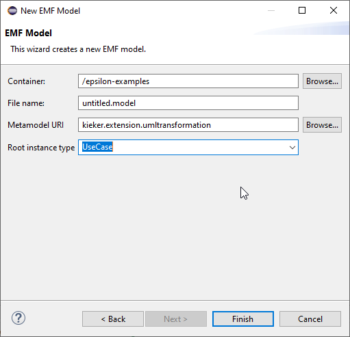

# kieker-extension-performanceanalysis
An extention to Kieker. It provides the possibility to transform the traces into a UML model and perform performance analysis actions on the UML model.

## Create Distribution Files

The following commands create .zip and .tar files in the folder `kieker-extension-performanceanalysis/build/distributions`.

Powershell:
```powershell
.\gradlew.bat kieker-extension-performanceanalysis:assembleDist 
```

Bash:
```bash
./gradlew kieker-extension-performanceanalysis:assembleDist 
```
To execute the distribution, unpackt it and run the appropriate script in the `bin` folder.

### Version Requirements 

* Java - 11
* lqns - 5.28.5 or higher to execute the resulting lqn.xml (lower versions might work but are not tested)


# Running the Application

The application provides the information required to run it (mostly).
If the command line arguments do not match the requirements, help will be provided.

The following sections provide help in creating a model in the UmlTransformation language and using the lqn solver.

## Creating A UmlTransformation Model

For the ``Uml2Uml`` transformation a UmlTransformation.model file is required.
First a setup of the meta-model is required and second a short description on how to create a .model file is given:

1. Download and install the Eclipse Epsilion distribution: \ 
https://eclipse.dev/epsilon/download/
2. Create a Workspace
3. Copy the file `kieker-extension-performanceanalysis/src/main/resources/metamodels/UmlTransformation.ecore` into the workspace
4. Right-click on the file and choose "Register EPackages" \
 \
The meta-model is now installed and models can be created. The following is a description on how to create model in the newly installed language.
5. Follow the path `File > New > Other...` \

6. Choose the ``EMF Model`` entry
7. In the next screen choose the meta-model-uri as ``kieker.extension.umltransformation``, the root instance type as `UseCase` and the other fields appropriate to your case \

8. Congratulations, you are now able to create UmlTransformation models.


## Layered Queuing Network Solver (lqns)

The result of the ``Uml2Lqn`` transformation is a ``lqn.xml`` to run the lqn solver please install it on your system from: https://www.sce.carleton.ca/rads/lqns/LQNSdownload/

After the installation the command to run the lqns is:

Powershell:
````powershell
lqns -P cycles=yes lqn.xml
````

Bash (untestet):
````bash
lqns -P cycles=yes lqn.xml
````

Please provide the appropriate file path to the `lqn.xml` file.

# Transformations

The intended chain of transformations is:
1. Kieker2Uml
    1. Uml2PlantUml (optional)
2. Uml2Uml
3. Uml2Lqn

## Kieker2Uml Transformation

This transformation takes kieker traces and creates a UML model from them.

## Uml2PlantUml

This transformation creates PlantUml files that can be converted into visual representations.
For more information visit https://plantuml.com/

## Uml2Uml

This transformation selects the use-cases in the UML model created from the ``Kieker2Uml`` and creates a reduced UML model.
Furthermore, the UML model is changed as described in the UmlTransformation model.

## Uml2Lqn

This transformation creates a lqn model from a UML model.
Preferably use the result of the `Uml2Uml` transformation.

